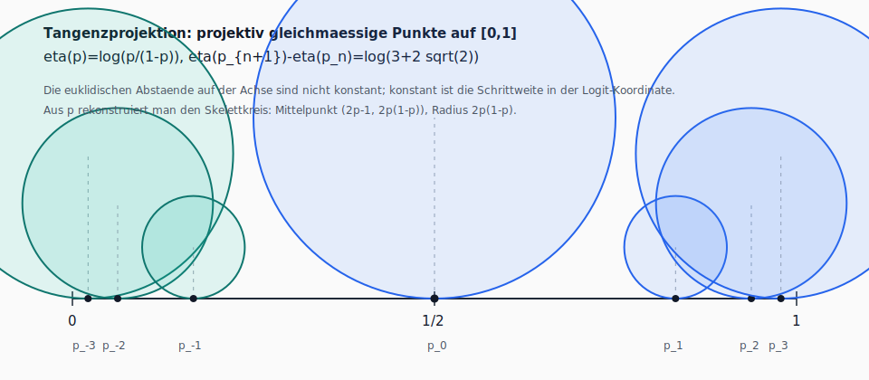

# Gleichmaessige Punkte auf einer Strecke

## Ausgangsfrage

Wir betrachten die abgeschlossene Strecke \([0,1]\). Die Endpunkte \(0\) und
\(1\) sind fest, und der Mittelpunkt \(1/2\) ist zunaechst gesetzt:

\[
P_0=\left\{0,\frac12,1\right\}.
\]

Die erste naive Frage lautet:

> Wie koennen Punkte so hinzugefuegt werden, dass alle benachbarten Punkte
> wieder denselben Abstand haben?

Diese Frage fuehrt zu zwei verschiedenen Programmen.

## Additive Halbierung

Die strengste lokale Regel lautet:

> In jedem Zug wird der Mittelpunkt jeder bestehenden Teilstrecke gesetzt.

Dann gilt nach \(k\) Zuegen:

\[
P_k=\left\{\frac{j}{2^{k+1}}\;\middle|\;j=0,\dots,2^{k+1}\right\},
\qquad
d_k=\frac1{2^{k+1}}.
\]

Die erreichbaren Punkte sind genau die dyadischen Brueche. Die neu
hinzukommende Generation besteht jeweils aus den Punkten mit ungeradem
Zaehler im neuen Zweiernenner.

Korollare:

- Die Raster sind verschachtelt: \(P_m\subseteq P_n\) fuer \(m\le n\).
- Die Generation eines Punkts ist an der hoechsten Zweierpotenz im Zaehler
  ablesbar.
- Die Vereinigung aller \(P_k\) ist abzaehlbar und dicht in \([0,1]\).
- Die binaere Symbolik speichert Information gleichmaessig, waehrend die
  euklidischen Abstaende halbiert werden.

## Projektive Tangenzprojektion

Aus der Tangenzgeometrie entsteht eine zweite, natuerlichere Verteilung auf
der Strecke. Fuer einen projizierten Tangenzpunkt \(p\in[0,1]\) laesst sich
der zugehoerige Skelettkreis rekonstruieren durch

\[
p\longmapsto
\bigl((2p-1,\;2p(1-p)),\;2p(1-p)\bigr),
\]

also mit Mittelpunkt \((2p-1,2p(1-p))\) und Radius

\[
r=2p(1-p).
\]

Die Skelettfolge ist nicht euklidisch gleichmaessig, sondern projektiv
gleichmaessig. Mit

\[
\lambda=(1+\sqrt2)^2=3+2\sqrt2
\]

gilt

\[
p_{n+1}
=
\frac{\lambda p_n}{1+(\lambda-1)p_n},
\]

aequivalent zu konstantem Kreuzverhaeltnis

\[
\frac{p_{n+1}(1-p_n)}{p_n(1-p_{n+1})}=\lambda.
\]

In der Logit-Koordinate

\[
\eta(p)=\log\frac{p}{1-p}
\]

wird daraus konstante Schrittweite:

\[
\eta(p_{n+1})-\eta(p_n)=\log(3+2\sqrt2).
\]

Damit lautet der zentrale Vergleich:

\[
\text{dyadische Halbierung}
\quad\leftrightarrow\quad
\text{additive Gleichmaessigkeit},
\]

\[
\text{Tangenzprojektion}
\quad\leftrightarrow\quad
\text{projektive Gleichmaessigkeit}.
\]

## Stern-Brocot-Randdynamik

Die Randverfeinerung wird durch die Matrizen

\[
L=\begin{pmatrix}1&0\\1&1\end{pmatrix},
\qquad
R=\begin{pmatrix}1&1\\0&1\end{pmatrix}
\]

beschrieben. Endliche Woerter \(w\in\{L,R\}^*\) kodieren Luecken, unendliche
Woerter kodieren Randpunkte.

Korollare:

- Jede endliche Basisluecke besitzt ein eindeutiges Wort in \(L,R\).
- Jede unendliche Folge in \(\{L,R\}^{\mathbb N}\) kodiert einen Randpunkt.
- Periodische Woerter entsprechen lokalen Selbstaehnlichkeiten.
- Endlich erzeugte Tangenzpunkte besitzen zwei symbolische Adressen.
- Die Dynamik ist als geordneter binaerer Baum mit der dyadischen Halbierung
  konjugiert, aber metrisch verschieden.

Eine besondere Rolle spielt das Silberwort

\[
LR^2L.
\]

Es reproduziert in der ersten Luecke dieselbe lokale Randform und erzeugt die
Pell-Rekursion

\[
u_{k+1}=6u_k-u_{k-1}.
\]

## Zeta-Funktion der Luecken

Fuer Lueckenlaengen \(\ell_w\) betrachten wir

\[
Z(s)=\sum_w \ell_w^s.
\]

Ueber die Bijektion zwischen Stern-Brocot-Woertern und positiven teilerfremden
Paaren \((u,v)\) gilt bis auf feste geometrische Faktoren

\[
\ell_w\asymp \frac1{u_wv_w}.
\]

Daher ist

\[
Z(s)\asymp
\sum_{\gcd(u,v)=1}\frac1{(uv)^s}
=
\frac{\zeta(s)^2}{\zeta(2s)}
\qquad (s>1).
\]

Der kritische Exponent ist somit exakt:

\[
\boxed{s_c=1}.
\]

Nahe \(s=1\) besitzt das Referenzmodell einen Doppelpol:

\[
Z_{\rm ref}(s)=2^s\frac{\zeta(s)^2}{\zeta(2s)}
\sim
\frac{12}{\pi^2}(s-1)^{-2}.
\]

Daraus ergibt sich fuer die Lueckenzaehlung die Ordnung

\[
N(\varepsilon)=
\Theta\!\left(
\varepsilon^{-1}\log\frac1\varepsilon
\right).
\]

## Multifraktale Vermutungen und Ergebnisse

Das faire Bernoulli-Mass auf den Symbolfolgen hat vollen Traeger und ist
atomlos. Numerisch ergibt sich fuer die typische lokale Dimension

\[
d_{\rm typ}=\frac{\log2}{\chi}
\approx 0.8748,
\qquad
\chi\approx0.7924.
\]

Diese typische Dimension ist startphasen-unabhaengig: Positive Anfangsvektoren
veraendern Zylinderlaengen nur um feste Faktoren.

Periodische Adressen liefern explizite Dimensionswerte. Fuer ein positives
periodisches Wort \(q\) gilt formal

\[
d(q^\infty)=\frac{|q|\log2}{2\log\rho_q},
\]

wobei \(\rho_q\) der dominante Eigenwert des zugehoerigen Matrixprodukts ist.

Beispiele:

\[
d((LR)^\infty)=\frac{\log2}{2\log\varphi}\approx0.72021,
\]

\[
d((LR^2L)^\infty)
=
\frac{2\log2}{\log(3+2\sqrt2)}
\approx0.78644.
\]

Fast-parabolische periodische Woerter

\[
q_n=L^{n-1}R
\]

erfuellen

\[
d(q_n^\infty)\to+\infty.
\]

Damit sind periodische Dimensionswerte dicht in

\[
\left[\frac{\log2}{2\log\varphi},\infty\right).
\]

Die parabolische Kusp ist nicht nur abzaehlbar. Es gibt eine unzaehlbare
Moran-Menge mit unendlicher lokaler Dimension und

\[
\dim_H E(+\infty)\ge\frac12.
\]

Die naechste scharfe Vermutung lautet:

\[
\dim_H E(+\infty)=\frac12.
\]

## Offene Arbeitsfragen

1. Existiert fuer jede Anfangsluecke eine fuehrende Konstante
   \[
   Z_{v_0}(s)\sim\frac{C(v_0)}{(s-1)^2}?
   \]

2. Gilt fuer Ebenensummen
   \[
   Z_n(s)\sim C_s n^{-s}
   \qquad(s>1)?
   \]

3. Ist das faire Randmass singulaer-stetig, und laesst sich die typische
   Dimension rigoros ueber einen Lyapunov-Exponenten bestimmen?

4. Ist
   \[
   \dim_H E(+\infty)=\frac12
   \]
   exakt?

5. Welche kleinste endliche Zusatzstruktur ueber der Projektion \(p\) macht
   die Apollonischen Generatoren wieder funktional?

